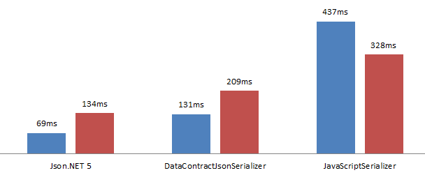

<div align='center' ><font color ="F7999F" size='30'>Cat Release</font></div>

<div align='center' ><font color="#437790" size='5'>A cat that helps the Unity development team with lightweight, fast, and persistent updates</font></div>
<div align='right' ><font color="#437790" size='3'>Auther:张兴</font></div> 
<div align='right' ><font color="#437790" size='3'>E_mail:iot_zx@163.com</font></div>


#### Version : 0.1.8(beta)  

##### Date : May 21,2020

##### Feather

- Awake工作流
  - 接口：Cat.Core.IAwakeWorkflow
  - 同,异步启动
- Sqlite配置型加载资源组件
  - Resource
  - AssetBundle
  - Web
- Log系统(目前支持安卓真机和PC)
  - LogUI,编辑和发布环境，在setting.json中开启和关闭
  - LogFile,将log信息分类写入日志文件，日志文件1小时一个，默认清理超过一周的日志
##### Depend

- Newtonsoft.Json(官方叫Json.Net)

  - version Release 5

  - ```php
    [Api](https://www.newtonsoft.com/json/help/html/M_Newtonsoft_Json_JsonSerializer_Deserialize.htm)
    ```

  - Api地址:

  - 速度

    

- TexeMesh Pro
  
  - version Release 1.0.54